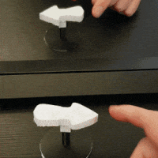
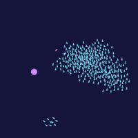
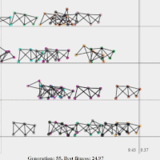

Welcome to my corner of GitHub. I mostly spend my time on here making fun little projects or workshops where I explore some area, often related to algorithms. Some things to check out:

[**Impossible objects**](https://github.com/Matsemann/impossible-objects) > 250 ⭐  
Using math to make optical illusions, I have showcased these on Deichmanske/Oslo Skaperfestival and various other occasions. 

[**Master thesis**](https://github.com/Matsemann/eamaster)  
Using evolutionary multiobjective optimization algorithms to evolve lacing patterns

**Some workshops I've made:**  
* [Boids workshp](https://github.com/Matsemann/boids-workshop): Program your own boid
* [Image workshop](https://github.com/Matsemann/image-workshop): Implement various image algorithms, most notably the cool seam carving algorithm
* [Max flow workshop](https://github.com/Matsemann/maxflow-workshop): Implement it and then use it to solve various problems
* [WalkingEa workshop](https://github.com/Matsemann/walkingea): Implement parts of a genetic algorithm and teach 2d objects to walk

**Other fun stuff:**  
* [Algorithm-problems](https://github.com/Matsemann/algorithm-problems): My solutions to various problems / competitions (Kattis, Advent of Code)
* [Declaraoids](https://github.com/Matsemann/Declaraoids) 70 ⭐: 1. april joke, where I used javascript ES6 proxies to make self-implementing code
* [Oculus FPV](https://github.com/Matsemann/oculus-fpv) > 450 ⭐: Old project where drone+oculus was combined

